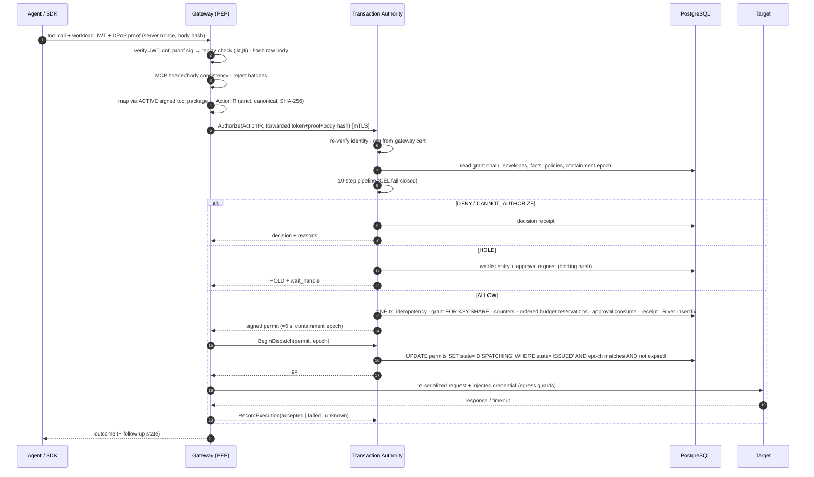

# PantherClaw — Architecture

**Status:** approved architecture for the MVP backend (G0, 2026-10-08). Versions verified 2026-10-08. Changes go through an ADR in [`docs/adr/`](adr/). Security rules that constrain this design are in [`security/HARDENING_RULES.md`](security/HARDENING_RULES.md) and win over anything here.

> **One sentence:** every consequential agent action passes through a PantherClaw gateway that authenticates the workload, canonicalizes the action, obtains a decision from the Transaction Authority under a task-specific grant, and — only if authorized — dispatches *exactly* the authorized request with credentials the agent never sees, while recording decision, execution and effect evidence separately.

## 1. Product invariants (non-negotiable)

1. **A named agent is not authority.** Bind every action to a verified workload instance, a represented principal and a valid task grant.
2. **Delegation never expands authority.** Child grant ⊆ parent; child cannot outlive parent; revocation cascades.
3. **Prohibitions win.** Effective authority = grant ∩ principal bounds ∩ org guardrails ∩ policy ∩ containment ∩ limits.
4. **Agent-provided claims are untrusted.** Task, identity, target classification, history and approvals come from trusted sources.
5. **Approvals are exact and revocable** — bound to the canonical action, decision basis, material facts, eligible approvers, grant/definition versions, agent instance and expiry; material change invalidates.
6. **Budgets are concurrency-safe** across parallel runs, children, split requests and retries.
7. **Decision ≠ execution ≠ effect.** Requested / authorized / dispatched / accepted / effect-verified / unknown are separate records.
8. **Fail closed.** Missing evidence → `CANNOT_AUTHORIZE`; known prohibition → `DENY`; nothing dispatches while conditions are unsatisfied.
9. **Retries are not new permission.** Stable logical action identity; never auto-retry irreversible work after an unknown outcome.
10. **Coverage is scoped.** `UNKNOWN | OBSERVE_ONLY | PARTIAL | ENFORCED`, per workload/target/effect/routes, with expiry.
11. **Receipt integrity ≠ proof of business effect.**
12. **Automations use bounded authority too.**

Decisions: `ALLOW`, `ALLOW_WITH_OBLIGATIONS`, `REQUIRE_APPROVAL`, `REQUIRE_STEP_UP`, `DENY`, `CANNOT_AUTHORIZE` (presented as Allow / Constrain / Hold / Deny / Cannot authorize).

## 2. System context

```mermaid
flowchart LR
  subgraph Customer agents
    A1[Agent + Python/TS/Go SDK]
    A2[Off-the-shelf MCP client<br/>Claude, Cursor, VS Code]
    A3[Claude Code / Agent SDK<br/>PreToolUse hook]
  end
  subgraph Data plane (customer network or co-located)
    GW[pantherclaw-gateway<br/>PEP · MCP proxy · HTTP proxy<br/>credential broker · connector runtime]
  end
  subgraph Control plane
    API[pantherclaw-server api<br/>Connect RPC · auth · tenancy]
    TA[Transaction Authority<br/>decision pipeline + finalization]
    WK[pantherclaw-server worker<br/>River jobs: chainer, verifiers,<br/>waitlist, detections, exports]
    PG[(PostgreSQL 17<br/>RLS FORCEd)]
  end
  subgraph Targets
    T1[Payments / CRM / Git / Cloud APIs]
    T2[MCP servers]
  end
  H[Humans: approvers, responders,<br/>admins via OIDC + WebAuthn] --> API
  A1 -- PAP/1 workload token + DPoP --> GW
  A2 -- stdio --> P[pclaw mcp proxy] -- PAP/1 --> GW
  A3 -. advisory check .-> GW
  GW -- mTLS Authorize/BeginDispatch/Record --> TA
  TA --- PG
  API --- PG
  WK --- PG
  GW -- re-serialized, credentialed request --> T1
  GW -- reviewed tool calls --> T2
  WK -. OCSF / webhooks .-> SIEM[(SIEM / SOAR)]
  WK -. global Merkle root .-> REKOR[(Sigstore Rekor v2)]
```

## 3. Components

| Component | Responsibility | Trust & privileges |
|---|---|---|
| `pantherclaw-server --role=api` | Connect-RPC APIs (gRPC + JSON over HTTP), human auth (OIDC RP, sessions, WebAuthn), service auth (`private_key_jwt`, API keys), tenancy/RBAC/SoD, inventory, grants, policies, approvals, waitlist, evidence explorer, licence/edition enforcement | DB role `pc_app` (no DDL, no BYPASSRLS); signs receipts/permits via KeyProvider; never holds target credentials in plaintext |
| Transaction Authority (`internal/authority`, inside server) | 10-step decision pipeline, finalization transaction, permits, `BeginDispatch`, execution recording | Same process as API; separate package boundary and tests |
| `pantherclaw-server --role=worker` | River workers: per-org evidence chainer, checkpoints/anchoring, verifiers & reconciliation, waitlist deadlines/escalations, schedules dispatcher, detections, exports, notifications, sweepers | `pc_app`; cross-org work only via one audited lister → per-org transactions |
| `pantherclaw-gateway` | PEP: workload authentication (PAP/1), MCP proxy (spec 2026-07-28 stateless + 2025-11-25), HTTP reverse proxy per registered connection, SDK endpoint, canonicalization via signed tool packages, credential broker (opens HPKE-sealed creds), dispatcher with egress guards, connector runtime (customer-hosted only) | **No database access.** Outbound-only mTLS to server (cert binds gateway to org(s)). In the TCB for the routes it mediates |
| `pclaw` | CLI: install/up/init/enroll, `mcp proxy` stdio shim, `scan`, `seal`, `verify`, `policy test/simulate`, `sandbox run`, `redteam run`, OIDC device-flow login | Holds workload key in OS key store (TPM/Secure Enclave when available); desktop attestation capped at L1 |
| `pclaw-admin` | Offline tooling: licence/package root key generation, licence signing, package signing | Runs on the founder's offline machine; keys never enter CI |
| `pantherclaw-sim` | Simulated payments / CRM / git+deploy targets with fault injection (timeout, unknown outcome, partial, drift, forged acceptance) | Test-only; every receipt marked `SIMULATED` |
| `sdk/go`, `sdk/python`, `sdk/typescript` (Apache-2.0) | PAP/1 client, DPoP, ActionIR types + canonicalizer, wait handles, framework wrappers, **target-side verifier middleware** | Untrusted side of TB1 |
| `integrations/claude-code` (Apache-2.0) | Claude Code plugin (PreToolUse for Bash and PowerShell tools, Windows path normalization), Agent SDK `canUseTool` | Cooperative ⇒ coverage PARTIAL unless creds are in custody |
| Private `pantherclaw-enterprise` (later) | SSO/SCIM, multi-org fleet, SIEM connectors, advanced detections/content, compliance packs, HA, SaaS ops | Builds `pantherclaw-server-ee` importing the public module through `internal/platform/extension` |

## 4. Layering and module rules

```
cmd/*                       wiring only (flags, config, DI)
internal/<module>/adapters  sqlc repositories, Connect handlers, external clients
internal/<module>/app       use cases, transaction boundaries, caller authorization, events
internal/<module>/domain    pure types, invariants, state machines — no I/O, no time.Now(), no randomness
internal/platform/*         config, log (slog + redaction), otel, db, crypto, keys, ids, clock, errors,
                            httpx (hardened servers/clients), extension, edition, version
```

Enforced by golangci-lint `depguard` + an architecture test:
- `domain` imports only the standard library, `internal/platform/{ids,errors,clock}` interfaces and other `domain` packages.
- `app` never imports `adapters`; adapters implement ports declared in `app`.
- `internal/gateway/...` never imports any server DB package; it talks to the server only through generated Connect clients.
- `encoding/json` (v1) is banned in core packages: use `encoding/json/v2` + `encoding/json/jsontext`.
- `math/rand`, `crypto/md5`, `crypto/sha1`, `crypto/des`, `crypto/rc4`, `unsafe`, `os/exec` (outside `internal/gateway/runtime` and `cmd/pclaw`), `fmt.Print*` and `log` (std) are forbidden (`forbidigo`).
- Time comes from `platform/clock` (injectable); security deadlines use the **database clock** (`now()`) inside transactions.

## 5. Contracts

- **Protobuf** (`proto/pantherclaw/v1/*.proto`) is the single API contract. `buf lint` + `buf breaking` gate every PR. Generated Go lives in `internal/gen` (committed).
- **connect-go v2** (`connectrpc.com/connect/v2`) serves gRPC, gRPC-Web and Connect JSON from one handler. SDKs call Connect JSON (plain HTTP POST) — no gRPC dependency for agents.
- **protovalidate** rules (CEL) declared in the protos are enforced by an interceptor before any handler runs; a second, domain-level validation always runs too.
- OpenAPI is generated from the protos for documentation and Schemathesis fuzzing.
- **ActionIR v1** and all signed artifacts are specified in [`protocol/PAP-1.md`](protocol/PAP-1.md).

## 6. The transaction path — "authorize what you forward, forward what you authorized"



### 6.1 The 10-step decision pipeline

| # | Step | Failure result |
|---|---|---|
| 1 | Scope & coverage — route known? enforce or monitor mode? | Unknown route in enforce mode → `CANNOT_AUTHORIZE`; monitor mode → hypothetical decision, never blocks |
| 2 | Identity — instance, launcher, represented principal meet required attestation level | `CANNOT_AUTHORIZE` |
| 3 | Containment — agent/run/grant/connection/package/resource suspended? org kill switch? | `DENY` (references response action) |
| 4 | Authority — valid grant; **every ancestor** valid and covering; envelope ceiling | No grant → `DENY`; expired/revoked → `DENY` |
| 5 | Exact meaning — action definition `ACTIVE`; params unambiguous | `CANNOT_AUTHORIZE` |
| 6 | Current facts — required facts present and fresh | `CANNOT_AUTHORIZE` |
| 7 | Boundaries — FORBID rules, lattice constraints, sequences, windows, counters, budgets (check) | FORBID/limit → `DENY`; CEL error in FORBID → `DENY` |
| 8 | Requirements — approval, step-up, constraints (must be supported by the tool package), custody, verifier | Unsupported obligation → `CANNOT_AUTHORIZE`; missing approval → `REQUIRE_APPROVAL`; missing step-up → `REQUIRE_STEP_UP` |
| 9 | Final binding — finalization transaction (reservations, consumption, permit) | Any 0-row conditional update → roll back → re-evaluate (HOLD/DENY/CANNOT_AUTHORIZE) |
| 10 | Observe — dispatch commit point, execution and effect receipts | UNKNOWN keeps reservation; reconciliation |

Output: decision, presentation, decisive reason first, full checklist (passed / failed / missing / n.a.), obligations with timing (before execution / after dispatch / before dependent work), requested vs effective action, versions (policy decision basis, grant revision, definition version), facts digest.

### 6.2 State machines (table-driven, exhaustively tested)

- **Permit:** `ISSUED → DISPATCHING → DISPATCHED`; `DISPATCHING → UNKNOWN` (stale); `ISSUED → RELEASED` (expired, sweeper). Nothing else.
- **Execution:** `REQUESTED → BLOCKED | WAITING | AUTHORIZED → DISPATCHED → ACCEPTED | FAILED | CANCELLED`.
- **Effect:** `CONFIRMED | NONE_CONFIRMED | PARTIAL | PROPAGATION_PENDING | CONFLICTING | UNVERIFIABLE | UNKNOWN | COMPENSATED`.
- Also: approval, waitlist entry, reconciliation, coverage, definition lifecycle (`UNCLASSIFIED → DRAFT → REVIEWED → ACTIVE → STALE | QUARANTINED → RETIRED`), agent lifecycle (`DISCOVERED → CLAIMED → VERIFIED → OBSERVED → PARTIALLY_PROTECTED → PROTECTED → SUSPENDED → RETIRED`), automation execution.
- Every transition is a conditional `UPDATE … WHERE state = <expected>`; 0 rows = lost race = re-read and decide.

### 6.3 Concurrency

- **Budgets:** rows per grouping (task, principal, account, team) with `limit_amount` and period key; locked in a fixed **ancestor-first id order**; conditional `UPDATE … SET reserved = reserved + $a WHERE spent + reserved + $a <= limit_amount`; any 0-row update rolls back the whole finalization; budget updates run **last** in the transaction (hot rows held briefly), and a row locked for longer than `authority.budget_lock_timeout` (100 ms) makes the decision `CANNOT_AUTHORIZE` `BUDGET_BUSY` instead of queueing. Ledger entries: reserve / commit / release / hold-unknown; commits land in the reservation's period. **Settlement is off the row** (ADR-0015): an outcome records its reservations settled and pending, and the sweep job applies them to the rows in batches, one update per row, in the same lock order. Until then a row counts them as reserved, which can only make a budget look more consumed, and views add them.
- **Counters** (e.g. "≤ 3 refunds per customer per day") are rows updated in the same transaction — never a CEL check-then-act.
- **Revocation race:** grants read `FOR KEY SHARE` with revision check inside finalization; containment epoch checked at `BeginDispatch`.
- **Idempotency:** unique `(org_id, run_id, action_id)` storing the canonical hash; same id + different hash ⇒ `DENY` + tamper alert; conflicts return the stored decision unchanged.
- **Evidence chaining** happens after commit, by a per-org chainer — never inside the authorization transaction.
- DB timeouts on every app connection: `statement_timeout`, `lock_timeout`, `idle_in_transaction_session_timeout`.

## 7. Data architecture

- **PostgreSQL 17** is the only authoritative store. pgx v5 pool; **sqlc** for typed queries; **goose** migrations (River's migrations imported so **squawk** lints one history).
- **Multi-tenancy:** every tenant table has `org_id`; composite `(org_id, id)` primary/foreign keys; all unique constraints include `org_id`; **RLS ENABLEd and FORCEd** with policies `org_id = (SELECT NULLIF(current_setting('app.org_id', true), '')::uuid)`; tenant set only via `set_config('app.org_id', $1, true)` at transaction start; `RESET ALL` when connections return to the pool; typed `OrgID` required by every repository method.
- **Roles:** `pc_migrator` (DDL, owns schema), `pc_app` (DML on tenant tables, no TRUNCATE/COPY/BYPASSRLS), `pc_audit_ro` (read-only evidence). Tests run as `pc_app`.
- **Append-only evidence:** `UPDATE`/`DELETE` revoked from `pc_app` on receipt and ledger tables.
- IDs are UUIDv7; immutable revision tables for grants, policies, packages, automations.
- Entity groups (full list in BUILD_GUIDE §7): tenancy, identity, authority, meaning, execution, coverage, secops, automations, evidence & audit (one mechanism), commercial.

## 8. Background work

- **River** (Postgres job queue) — jobs inserted with `InsertTx` inside business transactions = transactional outbox. Job args never contain secrets.
- Tenant schedules (automations, digests) use our own `schedules` table (`next_fire_at` UTC, `time/tzdata`, DST rules) and a dispatcher that claims due rows with `SKIP LOCKED` and enqueues unique `(schedule_id, fire_at)` jobs. River periodic jobs only for global maintenance.
- Expiry is enforced **at use time**; jobs only notify/clean up.

## 9. Gateway internals

| Package | Duty |
|---|---|
| `gateway/mcp` | MCP server face (Streamable HTTP, both spec versions) and upstream client; header/body consistency; batch rejection; reviewed tool descriptions served from the tool package; elicitation/sampling gated; private caching |
| `gateway/httpproxy` | Per-connection reverse proxy routes defined by tool packages; request → ActionIR mapping |
| `gateway/sdk` | Explicit authorize/execute/wait endpoints for SDKs |
| `gateway/dispatch` | Permit verification, `BeginDispatch`, outbound re-serialization, `RecordExecution`, circuit breaker on UNKNOWN rate |
| `gateway/egress` | Hardened `http.Transport`: no redirects, dial-time IP deny list, no proxy env, no client cert, Host/SNI from connection, size/decompression caps, secret-echo scanning |
| `gateway/broker` | Opens HPKE-sealed credentials in memory just in time; per-tenant/deployment broker keys |
| `gateway/runtime` | Connector runtime for MCP servers (customer-hosted gateways only): per-connector uid, namespaces, seccomp/landlock, egress via `egress` |

Gateway health: revocation/containment stream heartbeat; **fails closed** when stale > 2 s; loads a full containment snapshot before serving after start.

## 10. Identity

- **Humans:** OIDC relying party (Keycloak for dev, customer IdP in production), browser sessions + WebAuthn step-up; CLI uses OIDC device flow. PantherClaw never becomes a human IdP.
- **Workloads:** PAP/1 ([protocol/PAP-1.md](protocol/PAP-1.md)). L2 attestation accepts workload tokens from configured trusted issuers (GitHub Actions and Kubernetes presets first), so existing CI, cluster and agent identities are federated rather than replaced; `StartRun` can prove a represented user with an RFC 8693 subject token from the org's OIDC provider (ADR-0018).
- **Services:** `private_key_jwt` client credentials; scoped `pck_` API keys (never able to approve).
- **Gateways:** enrolled via one-time token; mTLS client certificate (24 h) from the internal CA binding gateway → org(s).

## 11. Cryptography & keys

Standard library only. Ed25519 signatures (optional ML-DSA-65 dual signature), AES-256-GCM envelope encryption with per-org/per-purpose DEKs (AAD = org|table|column|row), HPKE X-Wing (`MLKEM768X25519`) for sealed credentials, TLS 1.3 with post-quantum hybrid key exchange by default. KEKs via a `KeyProvider` port: local file (dev) → OpenBao Transit → cloud KMS. FIPS build variant with `GOFIPS140=certified`. Details: [security/SECURITY_BASELINES.md](security/SECURITY_BASELINES.md).

## 12. Evidence ledger

- Receipts (decision, execution, effect) and platform audit events are written **unchained** inside their business transaction.
- A per-org **chainer** (a per-org lock on the ledger head) links rows older than `pg_snapshot_xmin(pg_current_snapshot())` into the hash chain — no rollback gaps, no hot row in the authorization path.
- Merkle tiles and **signed checkpoints** per time window; one **global** root periodically anchored to Sigstore **Rekor v2** with an RFC 3161 timestamp (tenant activity is not revealed).
- `pclaw verify` checks signatures, chain continuity and consistency proofs offline. The ledger proves integrity of what it contains, not completeness.

## 13. Deployment modes

| Mode | Shape | Notes |
|---|---|---|
| Local / self-hosted | `pclaw up` → Docker Compose profiles `core`, `identity`, `observability`, `full-demo`, `sandbox` | Postgres in named volumes; demo exposure via authenticated Cloudflare Tunnel |
| Hybrid (commercial default) | Hosted control plane + customer-run gateway | Target creds never leave the customer network; outbound-only mTLS |
| SaaS | Multi-tenant control plane + hosted gateways | No third-party MCP servers in multi-tenant gateways |

Images: distroless, non-root, read-only rootfs, pinned by digest, multi-arch, signed + attested. Helm chart for Kubernetes.

## 14. Observability

`log/slog` JSON with mandatory fields and redaction; OpenTelemetry traces/metrics (otelconnect, pgx tracer) → OTLP → `grafana/otel-lgtm` in dev; Prometheus metrics; pprof on an admin-only listener. Request id, trace id and transaction id correlate every hop.

## 15. Performance SLOs

| Path | Target |
|---|---|
| Transactional (decision tx + permit) | Authorize p99 ≤ 25 ms; gateway overhead p99 ≤ 35 ms at 1k rps / 2 vCPU, co-located |
| Fast path (monitor mode, cached signed policy, async evidence) | p50 < 2 ms, p99 < 5 ms |
| Revocation / kill switch propagation | p99 < 1 s; gateway fail-closed at 2 s staleness |
| Budget safety | zero overspend at 1,000 concurrent reservations |
| Gateway memory | < 150 MB RSS at 1k rps |

Validated first by the M1.5 walking skeleton, then nightly (k6 + benchstat trends).

## 16. Residual risks (accepted, documented)

Gateway is in the TCB for its routes · revocation latency is bounded, not zero; in-flight requests complete · cooperative modes (SDK authorize, hooks) and opaque MCP routes are PARTIAL · in-grant misuse by a prompt-injected agent is constrained and detected, not prevented · exfiltration via allowed channels is reduced, not prevented · targets without query APIs cannot be reconciled automatically · single Postgres + fail-closed means DB loss = outage · a customer IdP admin can defeat separation of duties · Go cannot reliably zeroize secrets · the ledger proves integrity, not completeness.
